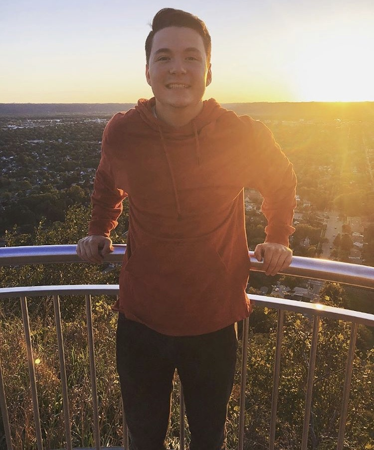

_Data Scientist based out of Milwaukee, Wisconsin_

[Email](mailto:johnoliver616@yahoo.com) / [GitHub](https://github.com/oliverjohnw) / [LinkedIn](https://www.linkedin.com/in/john-oliver-76508519a/) / [Twitter](https://twitter.com/olliejay00) / [Blog](https://www.olliejay00.com/)

## Technical Experience

**Data Scientist** @ [Elutions](https://www.elutions.com/) _(June 2022 - Present)_  

 

**Data Science Intern** @ [U.S. Geological Survey](https://www.usgs.gov/) _(June 2021 - June 2022)_ 

&nbsp;  _Applied multivariate statistics, exploratory data analysis, and data visualization with focus on natural resources and invasive + endangered species._  

 - Examined demographics of a sample of endangered Mussels with supervised and unsupervised techniques  

     * Non-Metric Multidimensional Scaling (NMDS), Principle Component Analysis (PCA), distance based Redundancy Analysis (db-RDA) in R 

 - Co-author of a paper examining relationship between selection of distance/dissimilarity metrics and performance of clustering, ordination, and canonical multivariate techniques   
     * Hierarchical Clustering, K-Means/Medoids, PCoA/PCA, NMDS and db-RDA in R on metabolomic datasets

 -  Demographic rate models for invasive Silver and Bighead Carp  
  
     - Hierarchical linear and logistic regression within R and Rstan

 -  Statistical consulting and model implementation to quantify agreement statistics in aging technique used among invasive Silver Carp  

     - Linear Mixed Models in lme4 package in R
 
   
  
 
**Mathematical Tutor** at [University of Wisconsin La-Crosse](https:https://www.uwlax.edu/) _(September 2019 - Present)_ 
 - Mathematical knowledge of collegiate-level mathematics courses including Algebra, Calculus, and Linear Algebra.
 - Advanced communication skills to ensure students' understanding

 
 

## Skills

**R**
 - [Supervised Learning](https://github.com/oliverjohnw/supervised-learning)
 - [Unsupervised Learning](https://github.com/oliverjohnw/unsupervised-learning)
 - dplyr, ggplot2
 - Rmarkdown
 

**Python**
 - [Supervised Learning](https://github.com/oliverjohnw/supervised-learning)
 - [Unsupervised Learning](https://github.com/oliverjohnw/unsupervised-learning)
 - Pandas, seaborn, matplotlib
 - Jupyter Notebook

**Version Control in Git**
 - Github/Gitlab
 - History revision

**Exploratory Data Analysis**

## Education

**Master of Science**  in Applied Statistics  
[University of Wisconsin La Crosse](https://www.uwlax.edu/grad/statistics/) - La Crosse, Wisconsin  
Spring 2020 - Fall 2021 (Expected)

**Bachelor of Science**  in Statistics  
[University of Wisconsin La Crosse](http://catalog.uwlax.edu/undergraduate/mathematics/statistics-bs/)  - La Crosse, Wisconsin  
Fall 2016 - Spring 2020 

 
 
 

  
  
  

